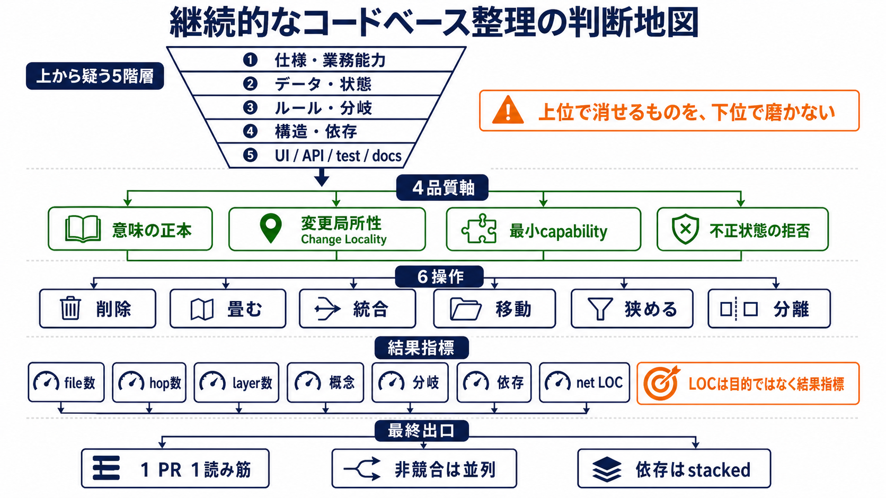

# skills

自作の agent skill を公開しています。
Claude Code / Codex など、Markdown ベースの skill を読めるコーディングエージェントで使えます。

> [!NOTE]
> この README の文章は AI（Claude Code）が生成し、人間が内容を確認しています。
> 各 skill 本体も AI との対話を通じて作成・改善しているものです。

## Skills

### [codebase-simplification](skills/codebase-simplification/SKILL.md)

継続的なコードベース整理の判断基準を提供する skill。
監査手順や特定アーキテクチャを正解として固定せず、整理候補の採否・方向・作業単位を同じ語彙で判断できるようにします。



- **上から疑う5階層**: 仕様 → データ・状態 → ルール・分岐 → 構造・依存 → surface。上位で消せるものを下位で磨かない。
- **4つの品質軸**: 意味のSingle Source of Truth / 変更局所性 / 最小capability / 不正状態の拒否
- **6つの操作**: 削除・畳む・統合・移動・狭める・分離。候補は必ず1語で表す。
- **結果指標**: LOCではなく working set（1変更のために読む・変える・壊しうる範囲）の純減で測る。

詳細:

- [SKILL.md](skills/codebase-simplification/SKILL.md) — 本体
- [judgment-framework.md](skills/codebase-simplification/references/judgment-framework.md) — 用語、証拠の強さ、採用質問、優先順位
- [examples.md](skills/codebase-simplification/references/examples.md) — 採用例・見送り例・PRの切り方

## インストール

skill ディレクトリを、使っているエージェントの skill 置き場へ symlink します。

```sh
git clone https://github.com/nntto/skills.git

# Claude Code
ln -s "$(pwd)/skills/skills/codebase-simplification" ~/.claude/skills/codebase-simplification

# Codex
ln -s "$(pwd)/skills/skills/codebase-simplification" ~/.codex/skills/codebase-simplification
```

コードベース整理・リファクタリング方針の相談時に自動で発火するほか、skill 名を指定して明示的に呼び出せます。
