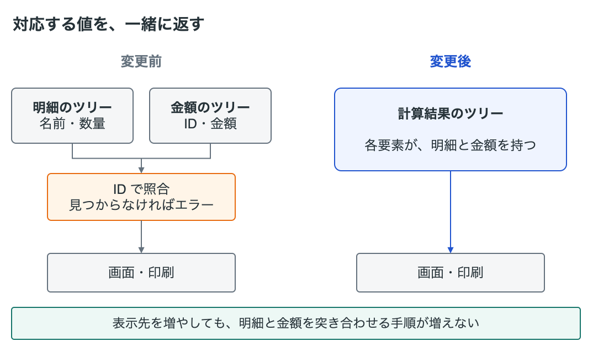
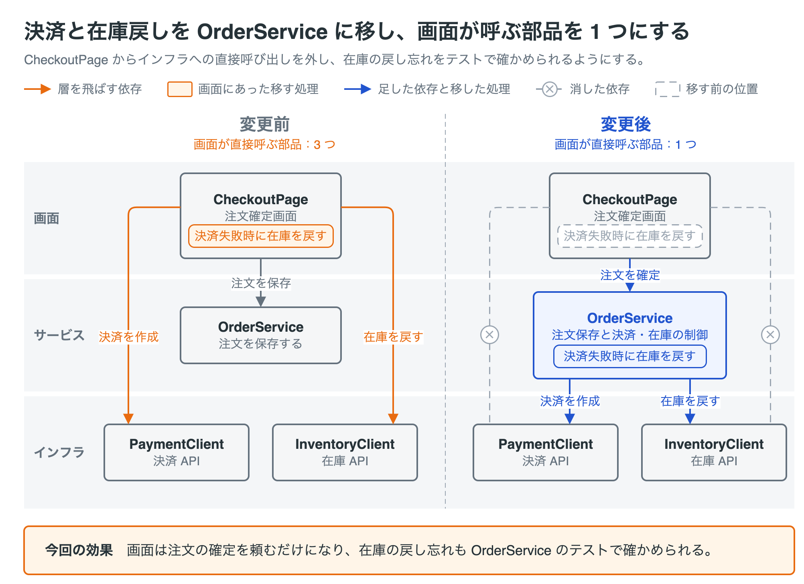

# skills

自作の agent skill を公開しています。
Claude Code や Codex など、Markdown で書かれた skill を読み込めるコーディングエージェントで使えます。

> [!NOTE]
> この README の文章は AI（Claude Code と Gemini）が生成し、人間が内容を確認しています。
> 各 skill 本体も、AI との対話を通じて作成・改善しています。

## Skills

| skill | 使う場面 |
|---|---|
| [codebase-simplification](skills/codebase-simplification/) | コードや設計をシンプルにして、変更しやすくしたいとき |
| [explanatory-diagrams](skills/explanatory-diagrams/) | PR や設計ドキュメントに載せる説明図を、draw.io で描くとき |

### codebase-simplification

1 つの変更のために読む場所、直す場所、覚えておく取り決めを減らすための skill です。
重複や複雑な分岐を利用側でまとめるだけでなく、元のデータの形やルールの持ち方から見直し、生成元で保証して処理そのものをなくせないかを検討します。
改善案の調査、リファクタリング、差分の整理で使います。



上の図は、明細と金額をセットで返すことで、表示側で対応を探し直す処理をなくした例です。

- 守るのは、利用者に必要な操作と実際の契約。既存の配置や処理は見直してよい。
- 意味と変更の理由が同じものはまとめ、違うものは分ける。
- 改善案は、何の知識・調整・処理が要らなくなるかで比べる。
- 十分な改善が見込めなければ、無理に候補を作らない。

詳しくは次のファイルにあります。

- [SKILL.md](skills/codebase-simplification/SKILL.md)：本体
- [README.md](skills/codebase-simplification/README.md)：整理の例 4 つ（draw.io の図と編集元のファイル）

### explanatory-diagrams

PR の本文、設計ドキュメント、レビューへの返信に載せる説明図を、draw.io で描くための skill です。
変更前後の比べ方、システム構成、データモデル、状態の置き場などを、どの記法でどう描くかを見本とともに示します。



- 見本は 18 枚あり、変更前後の見せ方（2 枚）、リファクタリングの説明（5 枚）、図の種類（AWS 構成図、シーケンス図、状態遷移図、C4、ER 図、BPMN など 11 枚）に分かれています。
- 画像はすべて `.drawio.png`（編集元の XML を埋め込んだ PNG）で、draw.io で開くとそのまま編集できます。
- 図の書き出しには、macOS の [draw.io デスクトップ版](https://www.drawio.com/) を使います。
- 見本のうち 2 枚は、実物の画像を埋め込んでいます。「画面と実装の対応」は Google 検索のトップページのスクリーンショット（著作権は Google LLC）を引用し、「外部資料の図の利用」は MemGPT の論文の図を CC BY 4.0 のライセンスに従って載せています。引用元やライセンス、こちらで加えた内容は、それぞれの図の中に書いています。

詳しくは次のファイルにあります。

- [SKILL.md](skills/explanatory-diagrams/SKILL.md)：本体
- [README.md](skills/explanatory-diagrams/README.md)：見本の一覧と使う場面
- [references/](skills/explanatory-diagrams/references/)：図形の参照先、配色と記法、書き出しと貼り付けの手順

## インストール

使いたい skill のディレクトリを、エージェントの skill 置き場へシンボリックリンク（symlink）します。

```sh
git clone https://github.com/nntto/skills.git

# Claude Code
ln -s "$(pwd)/skills/skills/<skill 名>" ~/.claude/skills/<skill 名>

# Codex
ln -s "$(pwd)/skills/skills/<skill 名>" ~/.agents/skills/<skill 名>
```

各 skill は、description に書かれた場面で自動的に使われるほか、skill 名を指定して呼び出すこともできます。
