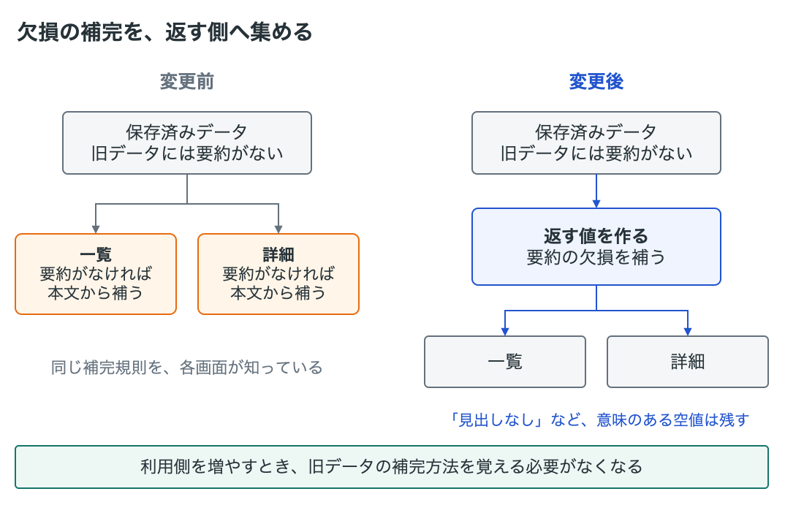
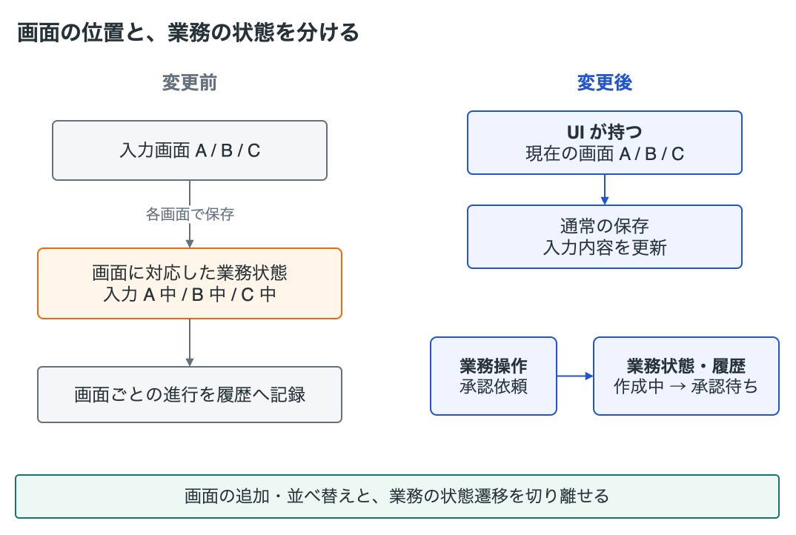
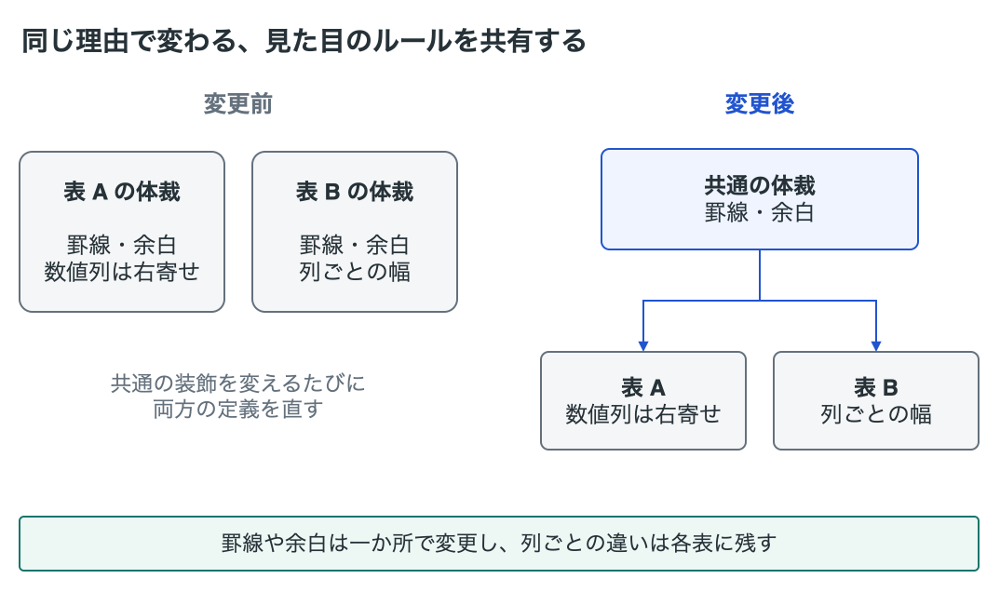

# コードを変更しやすくした例

過去の変更を一般化し、どんな整理が役立つのかを人向けにまとめた例です。
整理案を選ぶ判断基準は [SKILL.md](SKILL.md) にあります。

図では、灰色が既存の構造、青が変更点、橙が見直す箇所、緑が効果です。

## 対応づけ直す処理をなくす

明細から計算した金額をIDだけで返すと、表示側は明細との対応を探し直していました。
明細と金額を組にして返すことで、表示側の照合と対応漏れの確認が不要になりました。

[図を編集する](docs/examples/paired-results.drawio)

## 使える値を境界で渡す

検索結果の要約が欠けたときの補完を、利用側から返却値を作る境界へ移しました。
利用側は補完方法を覚えずに値を使えます。
「見出しがない」など意味のある空値は、補わずに残しています。

[図を編集する](docs/examples/boundary-defaults.drawio)

## 画面の都合を業務状態から外す

入力画面の位置と業務ステータスを分け、画面ごとの入力中の状態を「作成中」にまとめました。
画面の追加や順序の変更が、業務の状態遷移や履歴へ波及しにくくなりました。
入力段階を記録する仕様を変えたため、既存の状態と過去の履歴の値も移行しています。

[図を編集する](docs/examples/screen-and-workflow.drawio)

## 同じ理由で変わる体裁だけを共有する

同じ理由で変わる表の余白や罫線を、共通の定義へまとめました。
列の構成や数値列の位置は各表に残し、共通の体裁は一か所で変更できるようにしました。

[図を編集する](docs/examples/shared-style.drawio)
